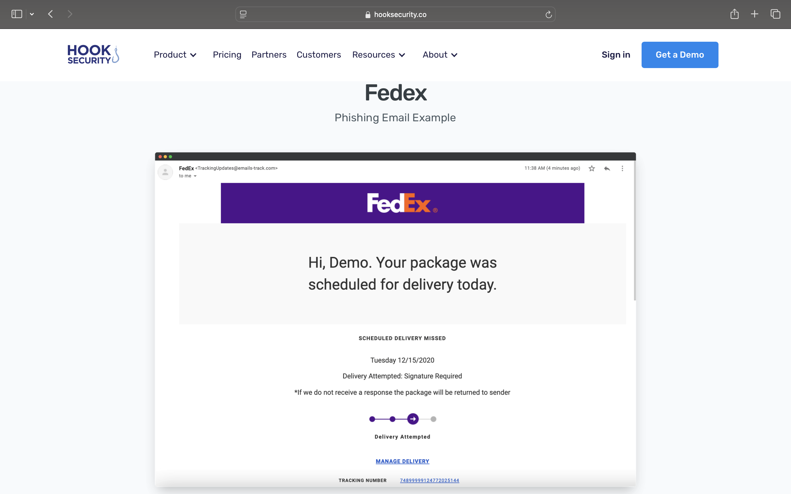

# Phishing Email Threat Analysis - FedEx Impersonation

## Overview
This project analyzes a real-world phishing email impersonating FedEx.
The objective is to identify common phishing indicators and udnerstand how social engineering tactics are used to manipulate recipients.

## Tools Used
- Hook Security (FedEx phishing email example)

## Objectives
- Identify phishing indicators in a real-world email sample
- Analyze sender information and message content
- Assess the potential risk if a user interacted with the email
- Improve defensive awareness against email-based threats

## Observations

### FedEx Phishing Email Sample

### Email Overview
The email impersonates the transportation company FedEx and claims a delivery issue requiring immediate action. The goal is to prompt the recipient to click a "Manage Delivery" or tracking number link to resolve the problem. 
This is targeted at consumers who are actively expecting a package; increasing the likelihood of user interaction.

### Phishing Indicators
**Display Name:** FedEx '<TrackingUpdates@emails-track.com>'
**Legitimate Domain:** 'fedex.com'
**Pressure Tactic:** "If we do not receive a response the package will be returned to sender
**Urgency Indicators:** "Delivery Attempted", immediate call-to-action

Additional indicators include brand impersonation, generic messaging, and a lack of personalized delivery details.

### Link Analysis
The phishing link in this example was sanitized and not directly accessible in the source material.
Despite this, the email exhibits multiple phishing indicators commonly associated with phishing campaigns, urgency-based language and a deceptive call-to-action designed to prompt user interaction.

## Risk Assessment
If a user interacted with the malicious link, the attack could result in credential theft, redirection to a fraudulent website, or further social engineering attempts.

## Mitigation Recommendations
- User security awareness training
- Email gateway filtering
- Blocking known malicious sender domains
- Encouraging users to report suspicious emails
